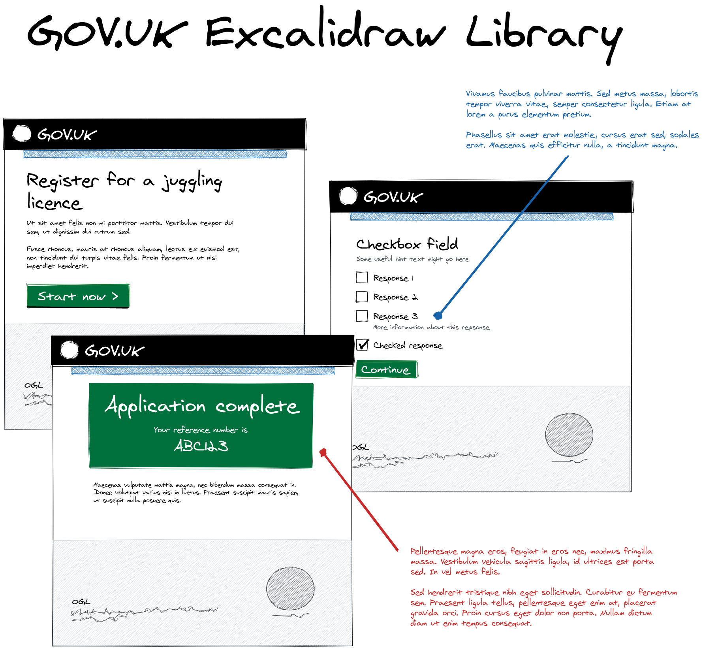

# GOV.UK Excalidraw Component Library

This is a set of [Excalidraw](https://excalidraw.com/) components that allow designers to quickly mock up
GOV.UK pages in a [low fidelity](https://www.nngroup.com/articles/ux-prototype-hi-lo-fidelity/)
manner.

## What is Excalidraw?

It's a diagram editor that's:

* totally free
* completely open source
* easy to use
* encrypted end-to-end
* runs in a browser (and doesn't require sign-up)

## How do I use this library?

1. download `govuk-components.excalidrawlib`
2. go to excalidraw.com
3. click on the library tool (`9`)
4. click 'load', and choose the file you just downloaded
5. all done!

## Example mockup

